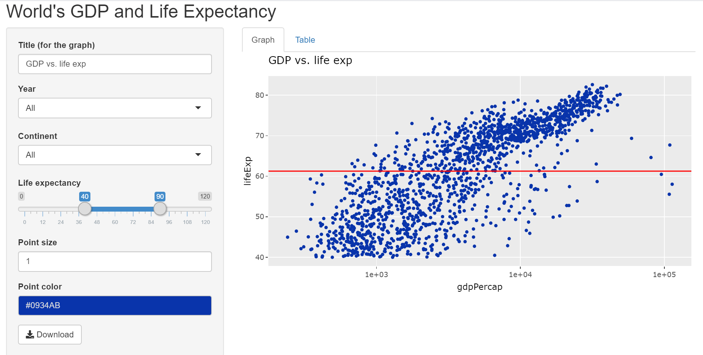

```{r setup, include=FALSE}
knitr::opts_chunk$set(echo = FALSE)
```

## Appication Overview
The app will visualize the World's GDP vs. Life Expentance for all the countries in different years using the Gapminder datasets.

The app has been developed using Shiny application from RStudio. The source code of the application can be found here.

## Function of Application
The app is a web application that is used to visualize the World's GDP vs. Life Expectancy. The applicaton allows the users to:

- Plot the data in a scatter plot (GDP vs. Life Expectancy)
- Create a set of parameters, such as year and continent, for data visualization.
- Customize data visualization.
- Generate a table for the data
- Download the data

## Application Interface
The is the main appliction interface.

```{r, echo=TRUE, out.width='100%'}

```

## Application Interface Details
The web app contains two sections: configuration and visualization part.

- **Configuration**: allows the users to filter the data and configure visualization of the data.
- **Visualization**: allows the users to see the (filtered) data being visualized in the form of graph/plot and table.


## Gapminder Datasets
The application is based on the [Gapminder](https://cran.r-project.org/web/packages/gapminder/README.html) datasets.

```{r, echo=TRUE, warning=FALSE}
library(gapminder)
str(gapminder)
```